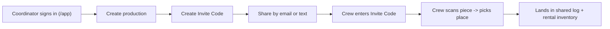

# Fabric Flo glossary and language contract

This is the single source of truth for Fabric Flo's product language, user flows, and core
invariants. Cursor rules and the Claude knowledge-pack export both pull from this file. When you
change product terminology or flows, update this file first, then refresh derived artifacts
(`npm run knowledge:export`).

## What Fabric Flo is

Phone-first app for film and TV productions to track **fabrics and their matching bags** on set.
Each physical piece is one row with its own dynamic QR code (or a handwritten rental-house label),
so crew can scan a piece, say where it is going, and have it land in a shared log and rental
inventory. Works offline on set; optional Supabase cloud sync adds email sign-in, multi-crew
productions, and Invite Codes.

## Core terminology (use these exact terms)

| Term | Meaning | Notes |
|------|---------|-------|
| **Invite Code** | The token a department head shares so crew can join a production. | Never call this a "join code". |
| **Production** | A single show/project. Top-level container for locations, inventory, and the scan log. | Routes refer to it as a "show" in some crew-facing copy. |
| **Fabric + bag pair** | One inventory row = one fabric and its matching bag, tracked together under the same dynamic QR or rental-house label. | There is no separate Fabric vs Bag UI. |
| **Dynamic QR** | The QR code Fabric Flo generates/recognizes for a piece. | Supports rotated/re-printed payloads via `qrAliases`. |
| **Rental-house label** | A handwritten or pre-printed number from the rental house, used instead of (or alongside) a QR. | Rental house examples: Best Films Service, WFW, MBS, Sunbelt. |
| **Scan method** | How a piece was identified at scan time: `qr`, `label`, or `manual`. | Stored on each scan (migration `009`). |
| **Rental list / log** | Department-head exports of inventory and scan history (CSV + PDF). | Download = CSV + PDF in one tap; Upload accepts CSV/PDF. |
| **Place / location** | Where a piece is going. Location kinds: studio, filming location, transport truck. | |

## Roles

`admin`, `department_head`, `crew`, `viewer` (see `production_members` in migration `002`).

- **admin / department_head** — create productions, create Invite Codes, edit inventory, import CSV.
- **crew** — scan pieces and record moves; cannot create Invite Codes.
- **viewer** — read-only.

## Routes

| Path | Page |
|------|------|
| `/` | Public marketing site (`MarketingPage.tsx`) |
| `/app` | Productions home + cloud sign-in (`HomePage.tsx`) |
| `/dashboard`, `/scan`, `/assign`, `/inventory`, `/locations`, `/log` | Require an active production |
| `/help`, `/privacy`, `/terms`, `/launch` | Public / informational |

## Primary user flow

This matches the smoke test in [`docs/BACKEND_SETUP.md`](BACKEND_SETUP.md): sign in, create production,
create Invite Code, second user accepts, scan, and the entry appears on both logs when online.

## Backend invariants (Supabase)

- Multi-crew productions and Invite Codes require the **normalized backend**:
  `VITE_FABRIC_FLO_BACKEND=normalized`. Without Supabase env vars the app runs on-device only
  (localStorage).
- **Rental house name** and **invite recipients** are stored in `productions.settings`
  (migration `009`); they are flattened onto each production on push and rehydrated on pull.
- **Scan method** lives on `scan_events.scan_method` (migration `009`).
- Migrations `001`–`009` (or the bundled `supabase/APPLY_ALL_MIGRATIONS.sql`) must be applied.
- See [`docs/BACKEND_API.md`](BACKEND_API.md) for the RPC surface and [`docs/SYNC.md`](SYNC.md) for
  the version/conflict model.

## Deprecated — do not reintroduce

- "Join code" wording (use **Invite Code**).
- All / Fabrics / Bags filters on the Log and Inventory pages.
- A separate Fabric vs Bag toggle or separate bag add form (one row is the fabric + bag pair).
- Treating fabric and bag as independently tracked items with separate QRs/labels.
