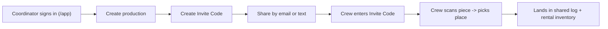

# Fabric Flo — Claude knowledge pack

Generated by `npm run knowledge:export` on 2026-06-01.
Source of truth for Fabric Flo's product language, user flows, and Supabase backend.

Contains no secrets, credentials, or user data. Safe to upload to a Claude.ai Project or share
with partners. To refresh, edit the source docs (starting with `docs/FABRIC_FLO_GLOSSARY.md`) and
re-run the command.

---

## Glossary and language contract

# Fabric Flo glossary and language contract

This is the single source of truth for Fabric Flo's product language, user flows, and core
invariants. Cursor rules and the Claude knowledge-pack export both pull from this file. When you
change product terminology or flows, update this file first, then refresh derived artifacts
(`npm run knowledge:export`).

## What Fabric Flo is

Phone-first app for film and TV productions to track **fabrics and their matching bags** on set.
Each physical piece is one row with its own dynamic QR code (or a handwritten rental-house label),
so crew can scan a piece, say where it is going, and have it land in a shared log and rental
inventory. Works offline on set; optional Supabase cloud sync adds email sign-in, multi-crew
productions, and Invite Codes.

## Core terminology (use these exact terms)

| Term | Meaning | Notes |
|------|---------|-------|
| **Invite Code** | The token a department head shares so crew can join a production. | Never call this a "join code". |
| **Production** | A single show/project. Top-level container for locations, inventory, and the scan log. | Routes refer to it as a "show" in some crew-facing copy. |
| **Fabric + bag pair** | One inventory row = one fabric and its matching bag, tracked together under the same dynamic QR or rental-house label. | There is no separate Fabric vs Bag UI. |
| **Dynamic QR** | The QR code Fabric Flo generates/recognizes for a piece. | Supports rotated/re-printed payloads via `qrAliases`. |
| **Rental-house label** | A handwritten or pre-printed number from the rental house, used instead of (or alongside) a QR. | Rental house examples: Best Films Service, WFW, MBS, Sunbelt. |
| **Scan method** | How a piece was identified at scan time: `qr`, `label`, or `manual`. | Stored on each scan (migration `009`). |
| **Rental list / log** | Department-head exports of inventory and scan history (CSV + PDF). | Download = CSV + PDF in one tap; Upload accepts CSV/PDF. |
| **Place / location** | Where a piece is going. Location kinds: studio, filming location, transport truck. | |
| **Last-seen location** | Where a fabric + bag pair was last scanned: the place plus the phone's GPS captured at scan time. | QR codes are passive, so this is last-known (not live). Surfaced on the Track page; coordinates stored on each scan (migration `010`). |

## Roles

`admin`, `department_head`, `crew`, `viewer` (see `production_members` in migration `002`).

- **admin / department_head** — create productions, create Invite Codes, edit inventory, import CSV.
- **crew** — scan pieces and record moves; cannot create Invite Codes.
- **viewer** — read-only.

## Routes

| Path | Page |
|------|------|
| `/` | Public marketing site (`MarketingPage.tsx`) |
| `/app` | Productions home + cloud sign-in (`HomePage.tsx`) |
| `/dashboard`, `/scan`, `/assign`, `/inventory`, `/locations`, `/track`, `/log` | Require an active production |
| `/track` | Track page: each fabric + bag pair's last-seen place and GPS, with an Open in Maps link |
| `/help`, `/privacy`, `/terms`, `/launch` | Public / informational |

## Primary user flow



This matches the smoke test in [`docs/BACKEND_SETUP.md`](BACKEND_SETUP.md): sign in, create production,
create Invite Code, second user accepts, scan, and the entry appears on both logs when online.

## Backend invariants (Supabase)

- Multi-crew productions and Invite Codes require the **normalized backend**:
  `VITE_FABRIC_FLO_BACKEND=normalized`. Without Supabase env vars the app runs on-device only
  (localStorage).
- **Rental house name** and **invite recipients** are stored in `productions.settings`
  (migration `009`); they are flattened onto each production on push and rehydrated on pull.
- **Scan method** lives on `scan_events.scan_method` (migration `009`).
- Migrations `001`–`009` (or the bundled `supabase/APPLY_ALL_MIGRATIONS.sql`) must be applied.
- See [`docs/BACKEND_API.md`](BACKEND_API.md) for the RPC surface and [`docs/SYNC.md`](SYNC.md) for
  the version/conflict model.

## Deprecated — do not reintroduce

- "Join code" wording (use **Invite Code**).
- All / Fabrics / Bags filters on the Log and Inventory pages.
- A separate Fabric vs Bag toggle or separate bag add form (one row is the fabric + bag pair).
- Treating fabric and bag as independently tracked items with separate QRs/labels.

---

## Domain types (src/types.ts)

```ts
export type LocationKind = "studio" | "filming_location" | "transport_truck";

export type ItemKind = "fabric" | "bag";

/** Rental health — default `ok` for items saved before this field existed. */
export type ItemCondition = "ok" | "lost" | "damaged";

/** How the piece was identified at scan time. */
export type ScanMethod = "qr" | "label" | "manual";

/** Where a last-seen position came from. `scan` = GPS at scan time; `tag` reserved for future BLE/UWB hardware tags. */
export type LastSeenSource = "scan" | "tag";

export interface NamedLocation {
  id: string;
  kind: LocationKind;
  name: string;
}

export interface InventoryItem {
  id: string;
  kind: ItemKind;
  name: string;
  /** Values that count as this item when scanned (supports rotated / dynamic QR payloads). */
  qrAliases: string[];
  /** e.g. 20'-0" x 20'-0" */
  size?: string;
  notes?: string;
  /** Omitted in older data — treat as `"ok"`. */
  condition?: ItemCondition;
}

export type InviteRecipient = {
  id: string;
  contact: string;
  kind: "email" | "phone";
};

export interface Production {
  id: string;
  name: string;
  /** Optional rental house name for exports/log context. */
  rentalHouseName?: string;
  locations: NamedLocation[];
  items: InventoryItem[];
  createdAt: string;
  /**
   * Optional PIN for department heads (legacy). Stored on this device only.
   */
  departmentHeadPin?: string;
  /** Crew contacts to share Invite Codes with (device-local list). */
  inviteRecipients?: InviteRecipient[];
}

export interface ScanLogEntry {
  id: string;
  productionId: string;
  itemId: string;
  itemKind: ItemKind;
  itemName: string;
  locationId: string;
  locationKind: LocationKind;
  locationLabel: string;
  scannedAt: string;
  rawQr: string;
  /** Stable key for server de-duplication on retry (defaults to scan `id`). */
  idempotencyKey?: string;
  /** Defaults to `qr` when omitted (older log rows). */
  scanMethod?: ScanMethod;
  /** Latitude captured at scan time, when location permission was granted. */
  lat?: number;
  /** Longitude captured at scan time, when location permission was granted. */
  lng?: number;
  /** GPS accuracy in meters, when available. */
  accuracy?: number;
  /** Where the position came from. Defaults to `"scan"` when omitted. */
  lastSeenSource?: LastSeenSource;
}

export type ProductionMemberRole = "admin" | "department_head" | "crew" | "viewer";

export interface AppData {
  productions: Production[];
  scanLog: ScanLogEntry[];
  activeProductionId: string | null;
  /** Server `productions.version` map when using normalized Supabase backend (`fabric_flo_pull` / `fabric_flo_push`). */
  productionVersions?: Record<string, number>;
  /** Caller's role per production when signed in with cloud (from `production_members`). */
  productionRoles?: Record<string, ProductionMemberRole>;
}

export const LOCATION_KIND_LABEL: Record<LocationKind, string> = {
  studio: "Studio",
  filming_location: "Filming location",
  transport_truck: "Transport truck",
};

export const LOCATION_KIND_ORDER: LocationKind[] = [
  "studio",
  "filming_location",
  "transport_truck",
];

export const ITEM_CONDITION_LABEL: Record<ItemCondition, string> = {
  ok: "In use",
  lost: "Lost",
  damaged: "Damaged",
};

export function effectiveItemCondition(item: Pick<InventoryItem, "condition">): ItemCondition {
  return item.condition === "lost" || item.condition === "damaged" ? item.condition : "ok";
}
```

---

## Backend API (Supabase RPCs)

# Fabric Flo backend API (Supabase)

The app can run in two persistence modes:

1. **Legacy blob** — table `user_app_state`: one JSON `state` column per authenticated user (migration `001_user_app_state.sql`). The client reads/writes the full `AppData` object.
2. **Normalized** — Postgres tables plus Row Level Security (`002_productions_normalized_rls.sql`) and **RPCs** (`003_fabric_flo_rpcs.sql`). Enable in the client with `VITE_FABRIC_FLO_BACKEND=normalized`.

## PostgREST surface (normalized mode)

Authenticated users call Supabase RPCs with the anon key and a valid JWT. Direct table writes for sensitive paths are denied by RLS where noted; mutations go through `SECURITY DEFINER` functions.

| RPC | Args | Returns | Purpose |
|-----|------|---------|---------|
| `fabric_flo_create_production` | `p_name text` | `uuid` | Creates a production row and a membership row for the caller as `admin`. |
| `fabric_flo_pull` | _(none)_ | `jsonb` | Bundle: `productions`, `scanLog`, `activeProductionId` (always null), `versions` (map of production id → version bigint). |
| `fabric_flo_push` | `p_state jsonb`, `p_expected_versions jsonb` default `{}` | `jsonb` | `{ ok: true, versions: { ... } }`. Replaces child rows for each production in `p_state.productions` the caller may edit (`admin`, `department_head`, `crew`). Optional optimistic lock: include expected server `version` per production id in `p_expected_versions`; mismatch raises `version_conflict` (SQLSTATE `P0001`). Writes `bundle_push` audit rows. |
| `fabric_flo_create_invite` | `p_production_id`, `p_role`, `p_email`, `p_expires_days` | `jsonb` | `{ inviteId, token, expiresAt, role }` — share `token` once; stored as SHA-256 hash server-side. |
| `fabric_flo_accept_invite` | `p_token text` | `jsonb` | `{ productionId, role }` — adds `production_members` row. |
| `fabric_flo_import_inventory_rows` | `p_production_id`, `p_rows jsonb`, `p_expected_version` | `jsonb` | `{ merged, added, version }` — each row is one physical piece; `merged` = rows with matching `id` updated (`admin` / `department_head` only). Max 500 rows. |

### `p_state` shape (aligned with `AppData`)

- `productions`: array of `{ id, name, createdAt?, departmentHeadPin?, rentalHouseName?, inviteRecipients?, locations[], items[] }`. Top-level `departmentHeadPin`, `rentalHouseName`, and `inviteRecipients` are merged into `productions.settings` on the server (migration `009`).
- `locations[]`: `{ id?, kind, name, sort_order? }` (`sort_order` defaults to 0).
- `items[]`: `{ id?, kind, name, qrAliases[], notes?, condition? }`.
- `scanLog[]`: only rows whose `productionId` appears in `productions[]` are applied. Fields: `id?, productionId, itemId, locationId, itemKind, itemName, locationKind, locationLabel, scannedAt?, rawQr`, optional `idempotencyKey` (unique when set), optional `scanMethod` (`qr` | `label` | `manual`, migration `009`), optional `lat`, `lng`, `accuracy` (GPS captured at scan time for the Track page, migration `010`).

### REST equivalents (if you add a BFF later)

Map the same contracts to production-scoped routes, for example:

- `POST /v1/productions` → create (same as `fabric_flo_create_production`).
- `GET /v1/me/bundle` → pull.
- `PUT /v1/me/bundle` → push with `If-Match` / body version map.
- `POST /v1/productions/:id/scans` → single scan append (optional decomposition of `fabric_flo_push`).
- `GET /v1/productions/:id/scans` → paginated log.
- `POST /v1/productions/:id/inventory/import` → CSV (server-side validation).

## Tables (reference)

See `002_productions_normalized_rls.sql`: `productions`, `production_members`, `production_invites`, `locations`, `inventory_items`, `item_qr_aliases`, `scan_events`.

## Audit log

`fabric_flo_audit_log` (`004_fabric_flo_audit_log.sql`) stores future security events. Rows are readable by `admin` and `department_head` on that production; clients cannot insert (RPCs or service role only).

---

## Sync and conflict model

# Sync and conflicts (normalized backend)

## Model

- Each **production** row has a monotonic `version` (bigint). `fabric_flo_pull` returns a `versions` map keyed by production UUID string.
- The client keeps `productionVersions` (optional on `AppData`) in local storage alongside the bundle.
- On **push**, the client sends `p_expected_versions` with the last known server version for each production it edits. If any value differs from the current row, the RPC raises **version_conflict** (SQLSTATE `P0001`).

## Recommended client flow

1. After a successful **pull**, merge the returned `versions` map into `productionVersions`.
2. Before **push**, build `p_expected_versions` from `productionVersions` for every production id present in the outgoing `productions` array. Omit a production to skip the lock for that row (useful for first push of a newly created production before any version is stored).
3. On **version_conflict**, refresh from the server with `fabric_flo_pull` (or prompt the user), merge or replace local state, update `productionVersions`, and retry the write if appropriate.

## Scan log and idempotency

- For each production included in a push, the server **deletes** existing `scan_events` for that production, then re-inserts from `p_state.scanLog` (full snapshot for in-bundle productions).
- Rows with a non-null `idempotency_key` use `ON CONFLICT DO NOTHING` so flaky networks can retry the same scan without duplicates.

## Offline queue (optional)

The production client does not ship a durable offline queue yet. For flaky networks, callers can:

- attach `idempotencyKey` to scan entries before push, and
- retry push after backoff when the RPC fails.

A future enhancement is IndexedDB-backed queued RPCs with exponential backoff.

---

## Backend setup (operator checklist)

# Fabric Flo — Backend setup (Supabase)

Do this **once per environment** (production; optional staging). The app cannot use crew invites or shared cloud sync until this is done.

## 1. Create a Supabase project

1. [supabase.com/dashboard](https://supabase.com/dashboard) → **New project**
2. Save the **database password** securely
3. Wait until the project is healthy

## 2. Apply database migrations

**Option A — one file (easiest)**

```bash
npm run supabase:bundle
```

Open **`supabase/APPLY_ALL_MIGRATIONS.sql`** in the repo, copy all, paste into Supabase **SQL Editor** → **Run**.

**Option B — file by file**

Run each file in `supabase/migrations/` in order: `001` … `009`.

## 3. Authentication

**Authentication → Providers**

- Enable **Email**
- Choose whether **Confirm email** is required for your rollout

**Authentication → URL configuration**

| Field | Value |
|-------|--------|
| Site URL | Your live app URL, e.g. `https://app.fabricflo.com` |
| Redirect URLs | Same origin with wildcard, e.g. `https://app.fabricflo.com/**` |

Add Netlify preview URLs only if you use branch deploys with a separate Supabase project.

## 4. API keys → app environment

**Project Settings → API**

Copy into hosting env (Netlify/Vercel) and local `.env`:

```env
VITE_SUPABASE_URL=https://YOUR_PROJECT.supabase.co
VITE_SUPABASE_ANON_KEY=eyJ...anon...
VITE_FABRIC_FLO_BACKEND=normalized
VITE_PUBLIC_APP_URL=https://YOUR_LIVE_HTTPS_URL
VITE_SUPPORT_EMAIL=you@yourdomain.com
VITE_PRIVACY_EMAIL=privacy@yourdomain.com
```

Redeploy after changing `VITE_*` (Vite bakes them at build time).

## 5. Verify

1. Deploy web app (see `docs/NETLIFY_DEPLOY.md` or `docs/WEBSITE.md`)
2. Open `https://YOUR_URL/launch` — env checks should pass
3. **Open app** → sign up → create production → **Crew invites** → create Invite Code
4. Second browser/incognito → accept invite → scan → both see log when online

## 6. Optional: full account deletion (auth user removed)

```bash
# Install Supabase CLI, link project, then:
supabase functions deploy delete-account --no-verify-jwt
```

Set in production `.env`:

```env
VITE_ACCOUNT_DELETE_EDGE=1
```

Without this, in-app deletion still wipes production data via `fabric_flo_delete_my_account` (migration `008`).

## What the backend provides

| Feature | Mechanism |
|---------|-----------|
| Email sign-in | Supabase Auth |
| Multi-crew productions | `productions` + `production_members` |
| Invite Codes | `fabric_flo_create_invite` / `fabric_flo_accept_invite` |
| Sync inventory & scans | `fabric_flo_pull` / `fabric_flo_push` |
| Rental house name | `productions.settings.rentalHouseName` (migration `009`) |
| Invite contact list | `productions.settings.inviteRecipients` (migration `009`) |
| Scan method (QR / label / manual) | `scan_events.scan_method` (migration `009`) |
| CSV inventory import | `fabric_flo_import_inventory_rows` |
| Account deletion | `fabric_flo_delete_my_account` + optional Edge Function |

## Local dev without cloud

Leave `.env` empty or omit Supabase keys — the app uses **localStorage** only. Invites and multi-device sync require step 4.

## Troubleshooting

| Symptom | Fix |
|---------|-----|
| Sign-in fails | Check Auth URL config and `VITE_PUBLIC_APP_URL` |
| `version_conflict` on sync | Tap sync banner → pull latest or retry |
| Invites disabled | `VITE_FABRIC_FLO_BACKEND=normalized` and signed in |
| Rental house not syncing | Run migration `009` and redeploy app |
| RLS errors | Migrations `002`+ not applied |

See also: `docs/BACKEND_API.md`, `docs/SYNC.md`, `docs/STORE_RELEASE.md`.

---

## Database tables (from migration 002)

Normalized schema tables:

- `productions`
- `production_members`
- `production_invites`
- `locations`
- `inventory_items`
- `item_qr_aliases`
- `scan_events`
